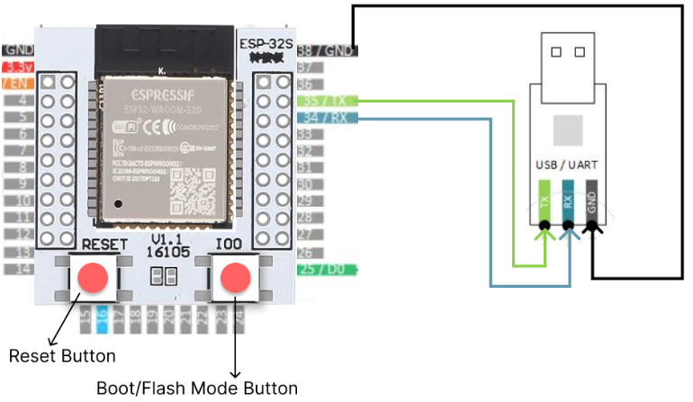
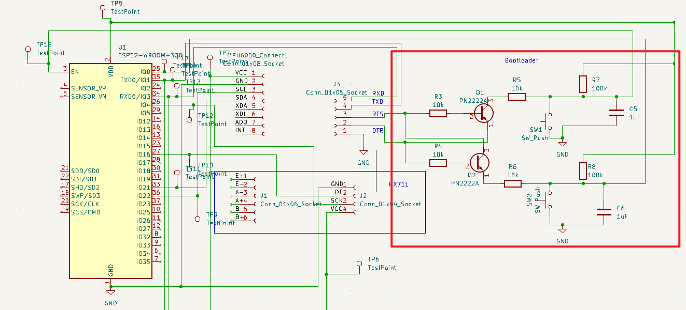
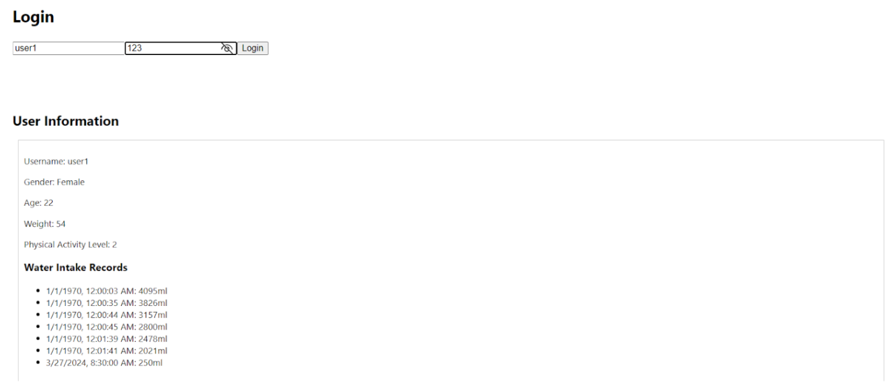
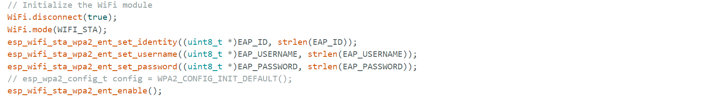
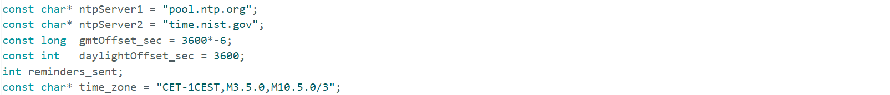
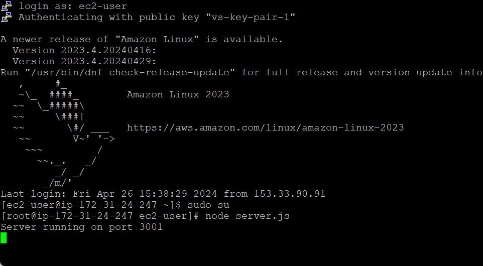
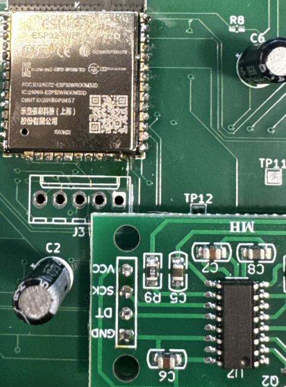

# Project Notebook

## Table of Contents

1. [First Team Meeting with TA - 2024-02-06](#2024-02-06)
2. [Testing the ESP32 Development Board & Meeting with TA - 2024-02-13](#2024-02-13)
3. [Switching from Development Board to Breakout Board - 2024-02-19](#2024-02-19)
4. [Third Time Meeting with TA - 2024-02-20](#2024-02-20)
5. [Fourth Time Meeting with TA - 2024-03-05](#2024-03-05)
6. [Implementing the Bootloader on PCB & Fifth Team Meeting with TA - 2024-03-19](#2024-03-19)
7. [Creating the Database on AWS and Connecting it to PostgreSQL - 2024-03-25](#2024-03-25)
8. [Fifth Meeting with TA - 2024-03-26](#2024-03-26)
9. [Starting Work on the Front End & Sixth Meeting with TA - 2024-04-02](#2024-04-02)
10. [Connecting ESP32 to School WiFi - 2024-04-08](#2024-04-08)
11. [Fixing the Time Code on ESP32 - 2024-04-10](#2024-04-10)
12. [Connecting the Front End App to Backend Database - 2024-04-12](#2024-04-12)
13. [Switching the Server from Localhost to a Remote Server - 2024-04-13](#2024-04-13)
14. [Getting the Reminder Functions to Work - 2024-04-15](#2024-04-15)
15. [Soldering the ESP32 onto PCB - 2024-04-22](#2024-04-22)
16. [Finishing Everything Up and Preparing for the Demo - 2024-04-24](#2024-04-24)

---

## 2024-02-06 First Team Meeting with TA

- Discuss our project proposal and preparations required to start building the project.
- Decide on using the ESP32 development board for the initial testing phase.
- Established roles and responsibilities within the team.

---

## 2024-02-13 Testing the ESP32 Development Board & Meeting with TA

- Test the basic functionality of the ESP32 by simulating input from a weight sensor using a potentiometer.
- Programmed the board using Arduino IDE to connect to Wi-Fi and read potentiometer values.
- Meet with TA to discuss about the power subsystem, recommend using powers from the development board for testing other subsystems since it has a 3.3V output.

**Figure 1: Testing Circuit Setup**

Successfully connected to Wi-Fi and read variable inputs from the potentiometer. This confirmed the board's capability for further development.

## 2024-02-19 Switching from Development Board to Breakout Board

- Transition from a development board to a breakout board setup.
- Established connections with USB/UART Bridge.

**Figure 2: ESP32 Breakout Board Setup**

Confirmed the breakout board's functionality with Arduino IDE. This setup will be used for subsequent tests.

## 2024-02-20 Third Team Meeting with TA

- Discussed about the solution for flashing the code to esp32 from Arduino IDE

---

## 2024-03-05 Fourth Team Meeting with TA

- Discussed about the circuit design for our pcb

---

## 2024-03-19 Implementing the Bootloader on PCB & Fifth Team Meeting with TA

- Design the PCB with a bootloader for the ESP32 module and created the CAD design for the PCB.
- Added bootloading functionality based on course guidelines.

**Figure 3: PCB Design**

### References:

- ECE 445 - Senior Design Laboratory course materials. [Link](https://courses.engr.illinois.edu/ece445/wiki/#/esp32_example/index)

The PCB design includes all necessary components and connections for implementing the bootloader.

---

## 2024-03-25 Creating the Database on AWS and Connecting it to PostgreSQL

- Created a database instance on AWS.
- Configured PostgreSQL to manage the database.

**Figure 4: Database Connection Test Page**

Successfully connected the database to a test website for basic high level requirement. This setup will support further application development.

---

## 2024-03-26 Fifth Team Meeting with TA

- Confirm with TA about the pcb design and submitted the order.

---

## 2024-04-02 Start working on the front end & Sixth Meeting with TA

- Start developing the front end of our application using Flutter based on predefined UI designs.
- Addressed issues related to user login and signup functionality.

---

## 2024-04-08 Connecting to school WiFi

Enable the ESP32 to connect to the school's WiFi network, which requires additional authentication. Configured the device to meet the school's network authentication requirements.

**Figure 5: WiFi Connection Configuration**

---

## 2024-04-10 Fixing the Time Code on ESP32

Identified issues with the initial time library and switched to a more reliable time management library.

**Figure 6: Corrected Time Code**

---

## 2024-04-12 Connecting the Front End App to Backend Database

Encountered and resolved data type mismatches by modified server-side code to handle data type conversions from JSON to integer or float.

---

## 2024-04-13 Switching the Server from Localhost to a Remote Server

Migrate the server hosting from a local machine to a remote AWS EC2 instance. This will enables for esp32 to communicate with the database without connecting to a computer.

---

## 2024-04-15 Getting the Reminder Functions to Work

- Implement and test reminder functionalities in the application by added a notifications table in the database.
- Programmed the app to monitor and respond to reminder flags from the database.

Reminders are now functional, with real-time notifications being triggered by changes in the database flags.

---

## 2024-04-22 Soldering the ESP32 onto PCB

Solder the ESP32 onto the project's main PCB.

**Figure 7: Soldering the ESP32**

---

## 2024-04-24 Finishing Everything Up and Preparing for the Demo

- Finalize all project components and prepare for the demo.
- Addressed a memory issue in microcontroller by adjusting data fetch routines.

All systems are operational and meet the high level requirement, and the project is ready for demonstration.
